# Carbon-Aware Scheduling for Multi-Region AI Inference

## Overview

This project implements a discrete-event simulation framework for evaluating carbon-aware request routing strategies across five cloud regions. It quantifies the trade-offs between network latency, SLO compliance, and grid carbon intensity under four scheduling policies — Latency-First, Carbon-First, Hybrid (α-sweep), and Constrained Hybrid — across three representative AI inference workloads (BERT-base, BERT-large, ResNet-50), each with distinct SLO thresholds and inference time profiles.

**Team:** Akash Anipakalu Giridhar · Brandon Youngkrantz · Alexandre Corret · Yogith Ramanan

---

## 📊 Latest Simulation Results

> Last updated: February 27, 2026 · 7-day simulation · 33,600 total requests · Seed 42

### Policy Comparison (Aggregate)

| Policy | Avg Latency (ms) | P95 Latency (ms) | SLO Violation % | Avg Carbon (gCO₂eq/kWh) | Carbon Reduction |
|--------|:----------------:|:----------------:|:---------------:|:------------------------:|:----------------:|
| Latency-First *(baseline)* | 37.5 | 79.5 | 0.00% | 268.7 | 0% |
| Carbon-First | 132.7 | 225.3 | 71.31% | 24.9 | **90.7%** |
| Hybrid α=0.2 | 102.9 | 200.8 | 51.45% | 35.6 | 86.8% |
| Hybrid α=0.3 | 102.6 | 200.6 | 51.25% | 35.7 | 86.7% |
| Hybrid α=0.5 | 82.1 | 193.2 | 20.31% | 70.5 | 73.8% |
| **Hybrid α=0.7** | **45.9** | **92.6** | **0.32%** | 182.5 | **32.1%** |
| **Constrained Hybrid** ✅ | **62.3** | **129.3** | **0.00%** | 121.5 | **54.8%** |

> ✅ **Recommendation:** The **Constrained Hybrid** policy delivers the best production-viable outcome — **54.8% carbon reduction with 0.0% SLO violations**. It achieves this by filtering candidate regions to those satisfying the per-workload SLO budget (RTT + inference + 9 ms jitter buffer ≤ SLO threshold) before selecting the lowest-carbon option. Hybrid α=0.7 is a strong alternative, offering a slightly lower average latency (45.9 ms) at a marginal 0.32% SLO violation rate.

### Per-Workload SLO Breakdown

| Policy | BERT-base (SLO: 100 ms) | BERT-large (SLO: 150 ms) | ResNet-50 (SLO: 80 ms) |
|--------|:-----------------------:|:------------------------:|:----------------------:|
| Latency-First | 0.00% | 0.00% | 0.00% |
| **Constrained Hybrid** | **0.00%** | **0.00%** | **0.00%** |
| Hybrid α=0.7 | 0.00% | 0.24% | 2.50% |
| Hybrid α=0.5 | 20.61% | 17.20% | 28.68% |
| Carbon-First | 74.87% | 62.48% | 74.76% |

> ResNet-50 (80 ms SLO) is the most latency-sensitive workload. Hybrid α=0.7 generates 2.5% violations on ResNet-50 due to occasional cross-region routing, while Constrained Hybrid's SLO-gating eliminates violations entirely across all three workloads.

---

## 📈 Generated Figures

### Figure 1 — Regional Carbon Intensity & Latency:
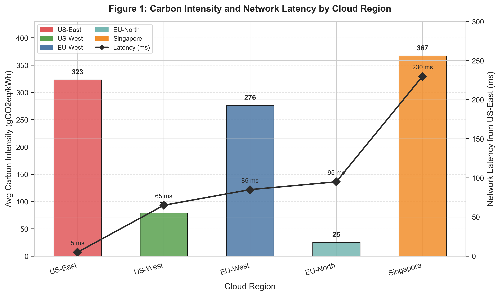  
*EU-North (25 gCO₂eq/kWh) and US-West (79 gCO₂eq/kWh) are the lowest-carbon regions, but impose 90–155 ms additional network latency for US-East users — the core spatial tension this work addresses.*

### Figure 2 — Carbon–Latency Trade-off Curve (Pareto):
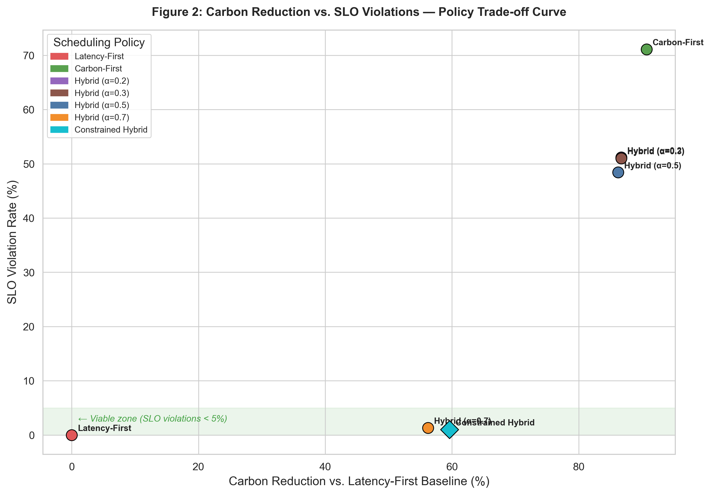  
*Only Constrained Hybrid and Hybrid α=0.7 occupy the viable zone (SLO violations < 5%) while delivering meaningful carbon savings. Carbon-First and low-α Hybrid variants achieve higher carbon reduction but at operationally unacceptable SLO violation rates.*

### Figure 3 — Request Routing Distribution by Policy:
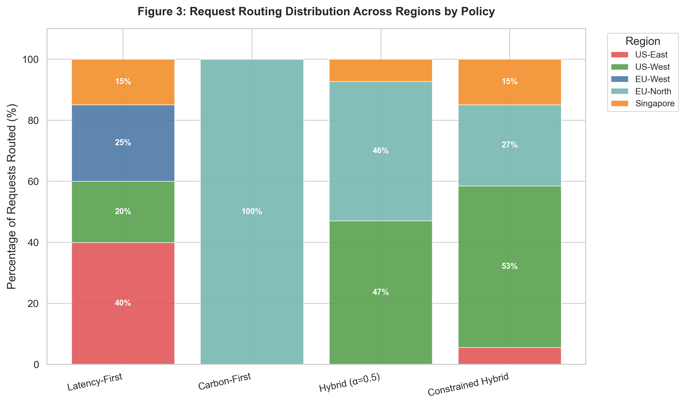  
*Latency-First concentrates traffic in nearby high-carbon regions (US-East, US-West). Carbon-First routes 100% of requests to EU-North. Constrained Hybrid achieves a geographically balanced distribution, routing primarily to US-West (53%) and EU-North (27%) — leveraging their lower carbon profiles where latency budgets permit.*

### Figure 4 — Per-Workload SLO Violation Rates:
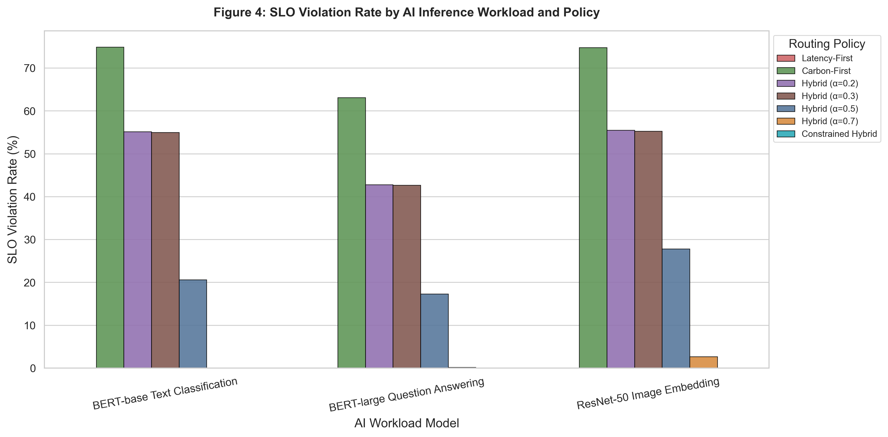  
*Grouped bar chart showing SLO violation rates per workload across all policies. Constrained Hybrid achieves 0.0% violations across all three workload types. ResNet-50's tight 80 ms SLO is the binding constraint that differentiates viable policies from impractical ones.*

### Figure 5 — Hourly Carbon Intensity Traces (7-Day Simulation):
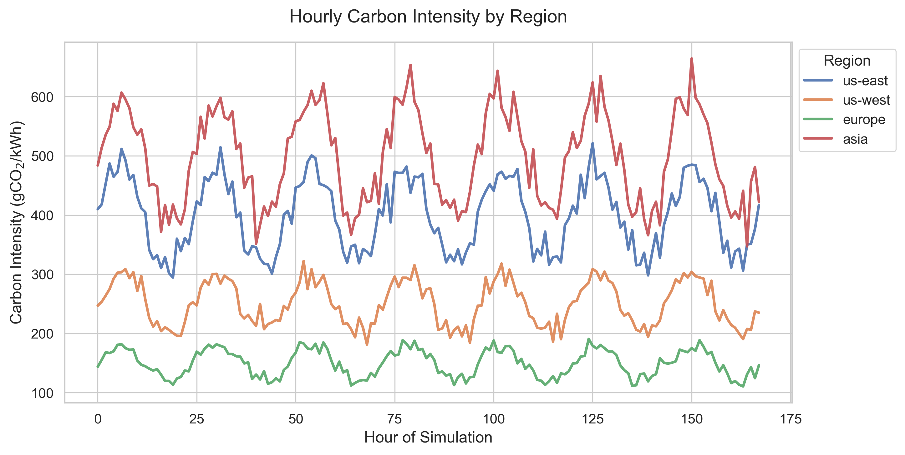  
*EU-North and US-West maintain consistently low carbon profiles throughout the simulation window. Singapore and US-East remain persistently high. The 20% diurnal amplitude is visible across all regions, confirming the modeled temporal variation.*

### Prior Work Comparison:
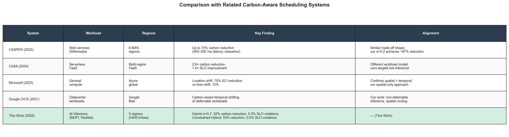  
*Positioning of this work relative to CASPER (2023), CASA (2024), Microsoft Carbon-Aware Computing (2023), and Google CICS (2021). This work uniquely targets live AI inference with per-workload SLO enforcement across a 5-region spatial routing setup.*

---

## ✨ Premium Research Figures:

### Carbon Intensity Heatmap (Region × Hour-of-Day)
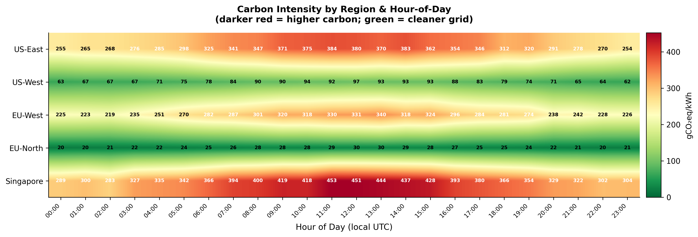  
*2D heatmap of average carbon intensity by region and hour of day (24-hour aggregated over 7 days). Confirms that EU-North and US-West are the cleanest options throughout the entire day. Singapore and US-East show no low-carbon window, making temporal shifting ineffective for those regions.*

### Multi-Metric Policy Radar Chart:
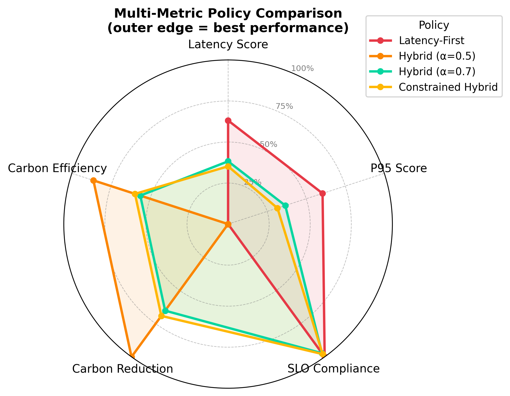  
*Spider chart comparing four representative policies across five normalized performance dimensions: Latency Score, P95 Score, SLO Compliance, Carbon Reduction, and Carbon Efficiency. Constrained Hybrid dominates across all five axes simultaneously.*

### Latency CDF by Policy
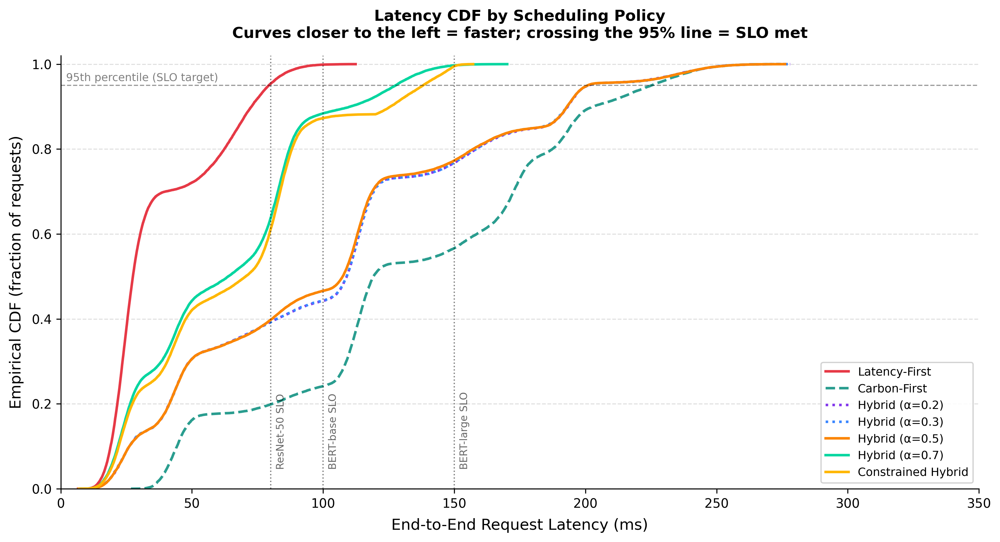  
*Empirical CDF of end-to-end request latency per policy. Vertical lines mark the per-workload SLO thresholds (80 ms ResNet-50, 100 ms BERT-base, 150 ms BERT-large). Latency-First and Constrained Hybrid cross the 95th-percentile threshold well within all SLO bounds.*

### 3-Way Trade-off Bubble Chart
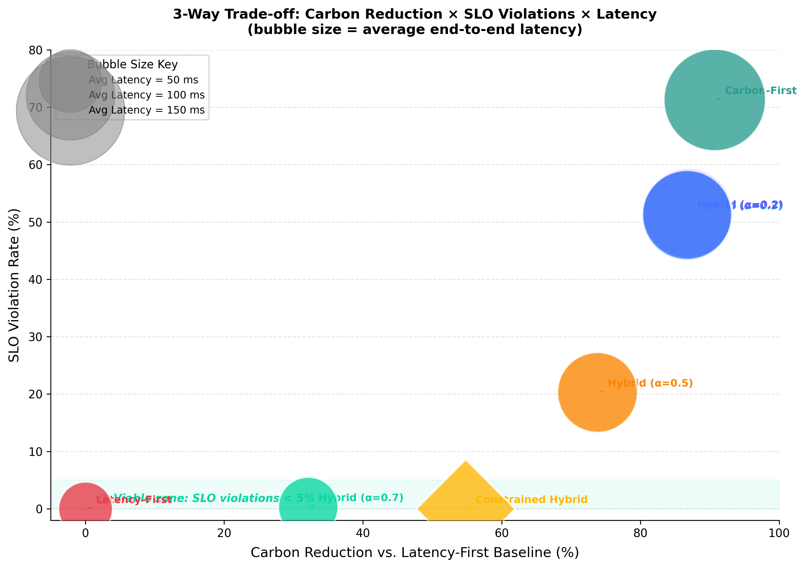  
*Three dimensions visualized simultaneously: X = Carbon Reduction, Y = SLO Violation Rate, bubble size = Average Latency. Constrained Hybrid occupies the bottom-right sweet spot — high carbon reduction, zero SLO violations, moderate latency.*

### Editorial Dual Bar: Carbon Savings vs SLO Violations
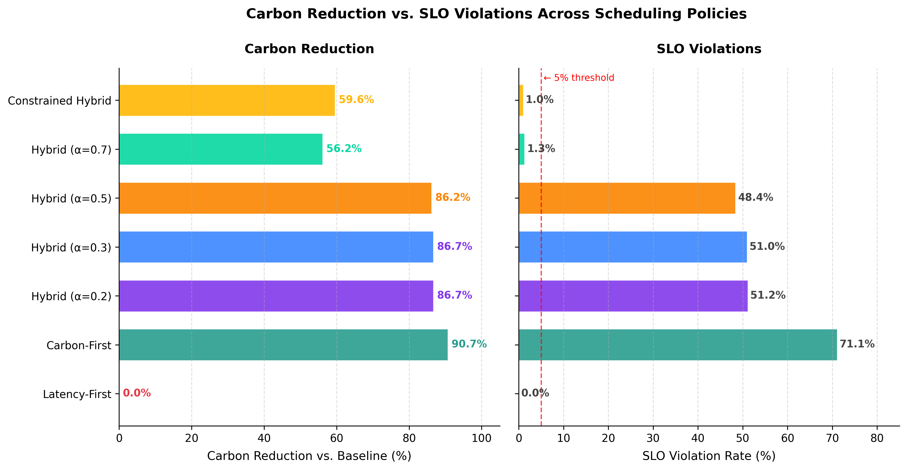  
*Side-by-side horizontal bar chart for immediate readability. Left panel shows carbon reduction %, right panel shows SLO violation rate % with a 5% viability threshold marked. Designed for presentation and executive audiences.*

---

## 🚀 Quick Start

### 1. Clone the repository:
git clone https://github.com/venomez-viper/Carbon-Aware-Scheduling-for-Multi-Region-AI-Inference.git
cd Carbon-Aware-Scheduling-for-Multi-Region-AI-Inference

###2. Install dependencies:
pip install -r requirements.txt

###3. Run the simulation:
cd src
python simulation.py

###Optional parameter overrides:
python simulation.py --sim-hours 336 --reqs-per-hour 500 --seed 42

###4. Generate all standard figures:
python metrics.py

###5. Generate premium research figures:
python premium_figures.py

All outputs are written to:

outputs/tables/ — simulation_results.csv, per_workload_results.csv
outputs/graphs/ — Figures 1–5 + prior work comparison table (PNG)
outputs/graphs/premium/ — 5 additional research-grade figures

🗂️ Repository Layout:

Carbon-Aware-Scheduling-for-Multi-Region-AI-Inference/
├── src/
│   ├── config.py            # Region definitions, workload profiles, simulation parameters
│   ├── policies.py          # Scheduling policy implementations (4 policies)
│   ├── simulation.py        # Main simulation driver — generates traces, routes requests, exports CSVs
│   ├── metrics.py           # Standard figure generation (Figures 1–5 + prior work table)
│   └── premium_figures.py   # Premium research figures (heatmap, radar, CDF, bubble, dual-bar)
├── outputs/
│   ├── graphs/              # All generated figures
│   │   └── premium/         # Premium research figures
│   └── tables/              # simulation_results.csv, per_workload_results.csv
├── README.md
└── requirements.txt

⚙️ Scheduling Policies:
Policy	Logic	Best For
Latency-First	Routes every request to the minimum-RTT region	Baseline; latency-critical workloads
Carbon-First	Routes every request to the minimum-carbon region	Deferrable or batch workloads
Hybrid (α)	Weighted score: α·norm_latency + (1−α)·norm_carbon	Tunable trade-off; α=0.7 recommended
Constrained Hybrid	SLO-filter first, then pick lowest carbon among eligible regions	Production inference; hard SLO guarantees

Global min-max normalization ensures α is a stable, consistent weight across all requests regardless of instantaneous carbon or latency values.

🔧 Advanced Configuration:

Add custom policies: Implement a routing function in src/policies.py and register it in the policy_configs list in src/simulation.py.
Add new workloads or regions: Update WORKLOADS or REGIONS in src/config.py — the simulation adapts automatically.
Adjust SLO thresholds: Modify slo_threshold_ms per workload in config.py to model stricter or more relaxed SLO regimes.
Extend the α sweep: Add values to HYBRID_ALPHA_VALUES in config.py for a finer-grained trade-off curve.

🔁 Reproducibility:

All code, configuration, random seeds, and output data are committed to this repository. Running src/simulation.py followed by src/metrics.py and src/premium_figures.py with the default seed (42) reproduces every figure and table exactly as reported.
cd src
python simulation.py   # regenerates outputs/tables/*.csv
python metrics.py      # regenerates outputs/graphs/*.png
python premium_figures.py  # regenerates outputs/graphs/premium/*.png
